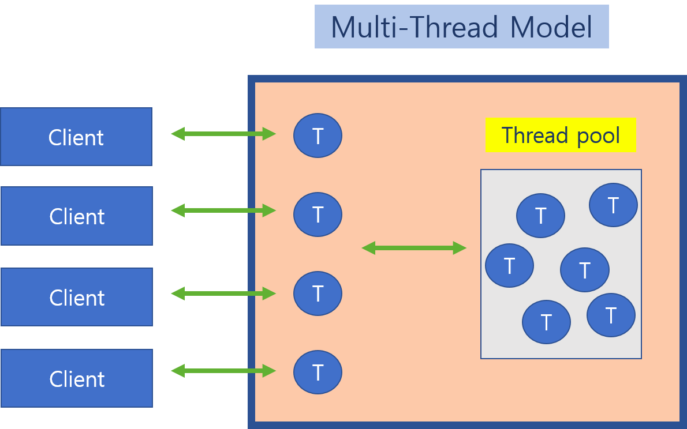
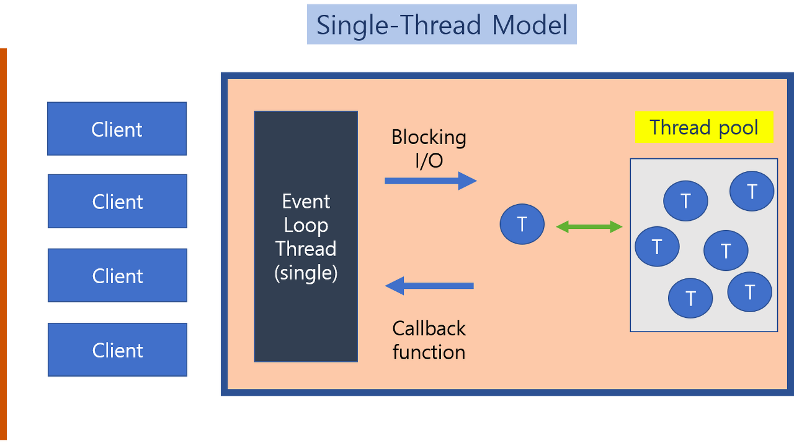
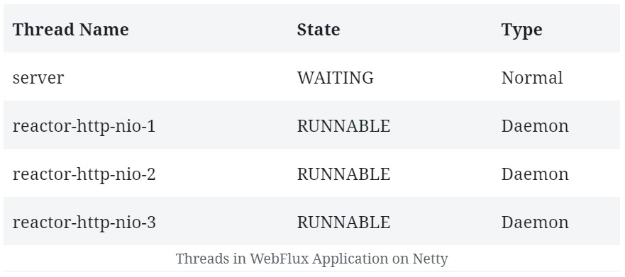
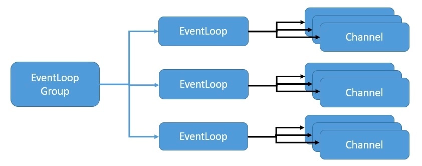

# WebFlux 세미나

## 순서

- ThreadPool vs EventLoop
- Reactor Netty
- WebFlux

## ThreadPool vs EventLoop


(thread pool)

- Thread : request = 1 : 1 할당
  - 초당 request 수가 적을 때 응답속도가 빠름
- CPU : Thread = n : m
  - blocking에 매우 발생해도 다른 request 작업은 Thread 여유가 있는 한 문제 없이 진행됨
  - 일반적으로 CPU 수 보다 많은 Thread를 가진 Pool로 관리
  - Thread간 stack을 공유하지 않으므로 CPU의 캐시 메모리를 비우고 채우는 전환 작업 빈번(Context Switching)


(event loop)

- Thread : request = n : m
  - 초당 request 수가 적거나 많거나 응답 속도 차이가 별로 없음
  - 상대적으로 많은 동시 request 처리 가능 
- CPU : Thread = 1 : 1 
  - blocking에 매우 취약해서 다른 request 처리에 영향을 줄 가능성이 높음
    - 별도의 blocking threadpool을 쓰거나 event queue로 처리
  - CPU와 Thread가 1:1 관계이므로 Context Switching이 이론적으로 없음

## Reactor Netty


(쿼드 코어에서의 WebFlux 시작 시 Thread 구성)

- WebFlux의 기본 내장 서버 모듈
- EventLoop 방식


(EventLoopGroup - EventLoop - Channel)

- 사용가능한 CPU 코어 수 보다 많은 EventLoop는 성능 저하만 일으킴
- Channel의 lifetime동안 동일한 Thread에서 실행하는 것을 보장

## WebFlux

### 개요

- 반응형 개발을 하기 위해 Reactor 3를 사용
- reactor operator(just, fromArray, range...) 메소드 형태로 제공
- concurrent agnostic: 동시성 불가지론적
  - 동시성 처리에 대한 강제성은 없음
  - 개발자가 상황에 맞는 적절한 스케쥴링 선택 가능

### 동기에서 비동기 전환 예제

reactor3/examples.md 문서 확인

### RouterFunction

```java
RouterFunction<ServerResponse> route = route()
        .path("/person", b1 -> b1
          .nest(accept(APPLICATION_JSON), b2 -> b2
            .GET("/{id}", handler::getPerson)
            .GET(handler::listPeople)
            .before(request -> ServerRequest.from(request) // 상단의 GET 두개 적용
              .header("X-RequestHeader", "Value")
              .build()))
          .POST(handler::createPerson))
    .after((request, response) -> logResponse(response))   // 모든 route 적용
    .build();
```

### Reactor Operator

(예제 소스 실행 테스트)

#### Flux

- Reactive Streams Publisher
- Flux sequences를 생성, 변형 등을 할 수 있는 operator 제공
- 생성: onNext
- 완료: onComplete, onError
- 종료 이벤트 없이는 무한하게 수행
- instance의 operator는 비동기적으로 사용됨

```java
Flux.interval(Duration.ofMillis(100))
  .take(10)
  .subscribe(System.out::println);

Thread.sleep(500);
System.out.println("end!!");
```
```
0
1
2
3
end!!
4
```
(비동기로 동작함을 알 수 있는 예제)

#### Mono

- 최대 1개의 element를 생성하는것에 특화된 Flux
- 무조건 0 or 1 이므로 element로 완료 또는 element 없이 에러로 완료만 있음

#### Merge

- 여러 개의 Publisher를 합칠 수 있음

```java
Flux<String> merge(Flux<String> f1, Flux<String> f2) {
    return f1.mergeWith(f2);
}

Flux<String> merge(Mono<String> m1, Mono<String> m2) {
    return m1.mergeWith(m2);
}
```

위와 같이 하면 순서 보장이 되지 않음 순서를 보장하려면,

```java
Flux<String> keepTheOrder(Flux<String> f1, Flux<String> f2) {
    return f1.concatWith(f2);
}

Flux<String> keepTheOrder(Mono<String> m1, Mono<String> m2) {
    return m1.concatWith(m2);
}
```

#### flatMap

- 각 element들을 비동기적으로 Publisher로 변환
- 각 Publisher를 비동기적으로 subscribe()
- subscribe의 결과로 발생한 데이터들을 모아서 Flux화
- 순서 보장이 안됨


```java
Mono<String> toUpperCaseSync(Mono<String> str) {
    return str.map(String::toUpperCase);
}

Mono<String> toUpperCaseAsync(Mono<String> str) {
    return str.flatMap(s -> Mono.just(s.toUpperCase()));
}

Flux<String> toUpperCasesSync(Flux<String> strs) {
    return strs.map(String::toUpperCase);
}

Flux<String> toUpperCasesAsync(Flux<String> strs) {
    return strs.flatMap(s -> Mono.just(s.toUpperCase()));
}
```

#### 기본 동작 순서 이해

- 기본적으로 subscribe 호출 담당 Thread 그대로 유지

```java
Flux.range(1, 4)
        .log()
        .map(i -> i * 10)
        .log()
        .map(i -> "num: " + i)
        .log()
        .subscribe();
```

```
INFO 66019 --- [main] reactor.Flux.MapFuseable.35              : | request(unbounded)
INFO 66019 --- [main] reactor.Flux.MapFuseable.34              : | request(unbounded)
INFO 66019 --- [main] reactor.Flux.Range.33                    : | request(unbounded)
INFO 66019 --- [main] reactor.Flux.Range.33                    : | onNext(1)
INFO 66019 --- [main] reactor.Flux.MapFuseable.34              : | onNext(10)
INFO 66019 --- [main] reactor.Flux.MapFuseable.35              : | onNext(num: 10)
INFO 66019 --- [main] reactor.Flux.Range.33                    : | onNext(2)
INFO 66019 --- [main] reactor.Flux.MapFuseable.34              : | onNext(20)
INFO 66019 --- [main] reactor.Flux.MapFuseable.35              : | onNext(num: 20)
INFO 66019 --- [main] reactor.Flux.Range.33                    : | onNext(3)
INFO 66019 --- [main] reactor.Flux.MapFuseable.34              : | onNext(30)
INFO 66019 --- [main] reactor.Flux.MapFuseable.35              : | onNext(num: 30)
INFO 66019 --- [main] reactor.Flux.Range.33                    : | onNext(4)
INFO 66019 --- [main] reactor.Flux.MapFuseable.34              : | onNext(40)
INFO 66019 --- [main] reactor.Flux.MapFuseable.35              : | onNext(num: 40)
INFO 66019 --- [main] reactor.Flux.Range.33                    : | onComplete()
INFO 66019 --- [main] reactor.Flux.MapFuseable.34              : | onComplete()
INFO 66019 --- [main] reactor.Flux.MapFuseable.35              : | onComplete()
```

#### publishOn

- up to down
- operator 실행 단계에서 적용
- 겹치면 순차적으로 적용

```java
Flux.range(1, 4)
        .publishOn(Schedulers.newSingle("pub1"))
        .log()
        .map(i -> i * 10)
        .log()
        .map(i -> "num: " + i)
        .log()
        .subscribe();
```

```
INFO 66019 --- [restartedMain] reactor.Flux.MapFuseable.38              : | request(unbounded)
INFO 66019 --- [restartedMain] reactor.Flux.MapFuseable.37              : | request(unbounded)
INFO 66019 --- [restartedMain] reactor.Flux.PublishOn.36                : | request(unbounded)
INFO 66019 --- [pub1-45] reactor.Flux.PublishOn.36                : | onNext(1)
INFO 66019 --- [pub1-45] reactor.Flux.MapFuseable.37              : | onNext(10)
INFO 66019 --- [pub1-45] reactor.Flux.MapFuseable.38              : | onNext(num: 10)
INFO 66019 --- [pub1-45] reactor.Flux.PublishOn.36                : | onNext(2)
INFO 66019 --- [pub1-45] reactor.Flux.MapFuseable.37              : | onNext(20)
INFO 66019 --- [pub1-45] reactor.Flux.MapFuseable.38              : | onNext(num: 20)
INFO 66019 --- [pub1-45] reactor.Flux.PublishOn.36                : | onNext(3)
INFO 66019 --- [pub1-45] reactor.Flux.MapFuseable.37              : | onNext(30)
INFO 66019 --- [pub1-45] reactor.Flux.MapFuseable.38              : | onNext(num: 30)
INFO 66019 --- [pub1-45] reactor.Flux.PublishOn.36                : | onNext(4)
INFO 66019 --- [pub1-45] reactor.Flux.MapFuseable.37              : | onNext(40)
INFO 66019 --- [pub1-45] reactor.Flux.MapFuseable.38              : | onNext(num: 40)
INFO 66019 --- [pub1-45] reactor.Flux.PublishOn.36                : | onComplete()
INFO 66019 --- [pub1-45] reactor.Flux.MapFuseable.37              : | onComplete()
INFO 66019 --- [pub1-45] reactor.Flux.MapFuseable.38              : | onComplete()
```

#### subscribeOn

- 
- subscribeOn은 중복을 무시하고 가장 먼저 등록한 스케쥴로 설정됨
- subscribe() 호출 직후에 초기화하면서 적용


```java
Flux.range(1, 4)
        .subscribeOn(Schedulers.newSingle("sub1"))
        .subscribeOn(Schedulers.newSingle("sub2"))
        .log()
        .map(i -> i * 10)
        .log()
        .map(i -> "num: " + i)
        .log()
        .subscribe();
```

```
INFO 68914 --- [sub1-20] reactor.Flux.SubscribeOn.19              : onNext(1)
INFO 68914 --- [sub1-20] reactor.Flux.Map.20                      : onNext(10)
INFO 68914 --- [sub1-20] reactor.Flux.Map.21                      : onNext(num: 10)
INFO 68914 --- [sub1-20] reactor.Flux.SubscribeOn.19              : onNext(2)
INFO 68914 --- [sub1-20] reactor.Flux.Map.20                      : onNext(20)
INFO 68914 --- [sub1-20] reactor.Flux.Map.21                      : onNext(num: 20)
INFO 68914 --- [sub1-20] reactor.Flux.SubscribeOn.19              : onNext(3)
INFO 68914 --- [sub1-20] reactor.Flux.Map.20                      : onNext(30)
INFO 68914 --- [sub1-20] reactor.Flux.Map.21                      : onNext(num: 30)
INFO 68914 --- [sub1-20] reactor.Flux.SubscribeOn.19              : onNext(4)
INFO 68914 --- [sub1-20] reactor.Flux.Map.20                      : onNext(40)
INFO 68914 --- [sub1-20] reactor.Flux.Map.21                      : onNext(num: 40)
INFO 68914 --- [sub1-20] reactor.Flux.SubscribeOn.19              : onComplete()
INFO 68914 --- [sub1-20] reactor.Flux.Map.20                      : onComplete()
INFO 68914 --- [sub1-20] reactor.Flux.Map.21                      : onComplete()
```

#### publishOn, subscribeOn 동시 적용

```java
Flux.just("hello")                                                                           // 3.
    .doOnNext(v -> System.out.println("just " + Thread.currentThread().getName()))           // 4.
    .publishOn(Scheduler.boundedElastic())                                                   // 5.
    .doOnNext(v -> System.out.println("publish " + Thread.currentThread().getName()))        // 6.
    .delayElements(Duration.ofMillis(500))                                                   // 7.
    .subscribeOn(Schedulers.elastic())                                                       // 2. 8.
    .subscribe(v -> System.out.println(v + " delayed " + Thread.currentThread().getName())); // 1. 9.
```

```
just elastic-1
publish boundedElastic-1
hello delayed parallel-1
```

1. main thread가 subscribe 호출
2. subscribeOn에 의해 subscription 및 위 방향으로 곧바로 Schedulers.elastic() 으로 전환
3. elastic을 통해 emit hello
4. 첫번째 doOnNext에서 elastic이 직접 'just' 출력
5. publishOn에 의해 아래 방향으로 Schedulers.boundedElastic() 으로 전환
6. 두번째 doOnNext에서 boundedElastic이이 데이터를 수신해서 'publish' 출력
7. delayElements는 시간 연산자이므로 기본적으로 Schedulers.parallel()을 사용(publishOn)해서 아래 방향으로 전환
8. 데이터 경로상에서(on the data path) subscribeOn는 아무것도 하지 않음
9. 데이터 경로상에서 subscribe 내의 람다식은 데이터를 수신한 Thread에서 처리하므로 parallel이 'hello delayed' 출력


### debugging

(reactor3/debugging.md 문서 확인)

### StepVerifier

- 테스트용 tool

(reactor-demo 프로젝트의 WebFluxUnitTest 확인)

### transaction

(reactor3/reactive-transaction.md 문서 확인)